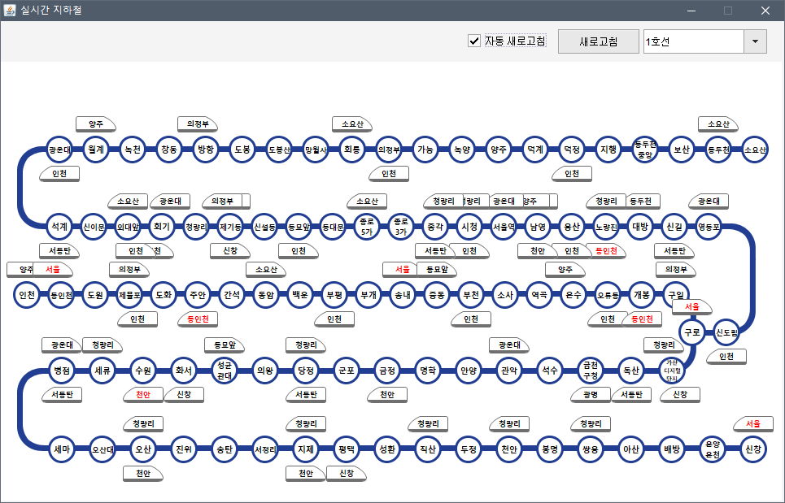
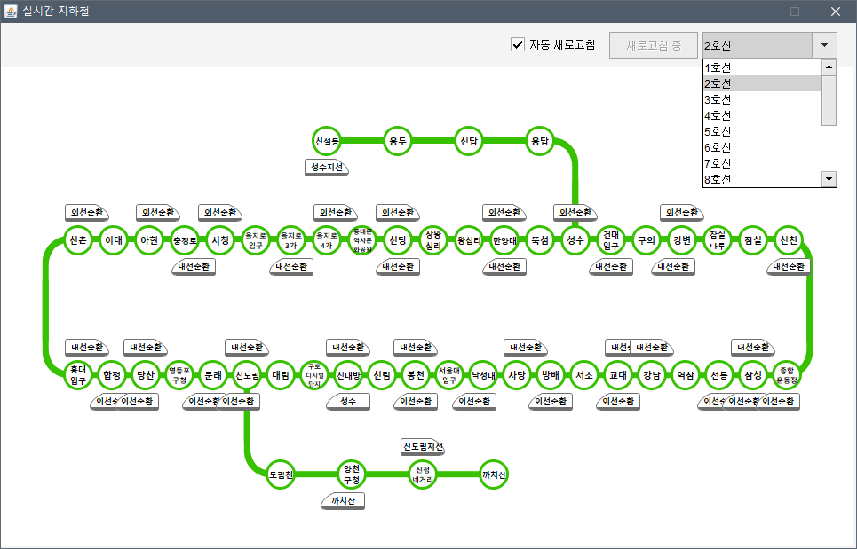

# 실시간 지하철

자바프로그래밍 수업에서 프로젝트로 진행한 실시간 지하철 위치 정보 프로그램




## 개발

Windows 10

eclipse Neon.2

Java 8 - Swing


## 설명

자바프로그래밍 수업시간에 Swing을 배웠고 배운 것을 활용해 프로젝트를 만드는 것이 목표이다. 인터넷에서는 계산기, 포스기 이런 것처럼 흔하디 흔한 것들이 많았다. 조금 특별한 것을 만들어봐야 성취감이 더 들지 않을까? 이미 안드로이드 버전으로 <a href="https://play.google.com/store/apps/details?id=com.ganada.silsiganmetro">실시간 지하철</a> 앱을 만들어봤기 때문에 이번에는 PC 버전으로 내놓자 하는 생각으로 자바 Swing을 이용해 만들어보았다.


> 주의!
>
> 코드가 심히 복잡하다. 조건 처리가 많아 중첩 if문이 많고 원본 데이터에 정렬이 되어있지 않고 정렬이 불가능한 데이터라 그냥 가장 간단한 for문과 if문을 이용해 중첩시킨 것이다.


이 프로그램을 정상적으로 실행하기 위해서는 <a href="http://data.seoul.go.kr/">서울 열린데이터 광장</a>에서 <a href="http://data.seoul.go.kr/dataList/datasetView.do?infId=OA-12601&srvType=A&serviceKind=1&currentPageNo=1">서울시 지하철 실시간 열차 위치정보</a>의 API키가 필요하다. API키를 발급 받고 <a href="https://github.com/CPstudy/MetroProject/blob/master/MetroProject/src/Main.java">Main.java</a>의 `loadData()` 함수 안에 있는 URL 부분 `(인증키)` 부분에 발급받은 키값을 넣으면 된다.


역 목록은 <a href="https://github.com/CPstudy/MetroProject/blob/master/MetroProject/src/DataTest.java">DataTest.java</a>에서 관리한다. `http://guide94.cafe24.com/json2/` 뒤에 `노선번호.json`을 붙이면 역 모록을 불러온다. 예시로 2호선의 역 목록을 간단하게 보자면 다음과 같다.

```json
[
  {
    "code": 1002000212,
    "name": "건대입구",
    "type": 1,
    "express": 0,
    "html": "건대<br>입구",
    "size": 9,
    "x": 670,
    "y": 178,
    "train": 0
  },
  {
    "code": 1002000213,
    "name": "구의",
    "type": 0,
    "express": 0,
    "html": "구의",
    "size": 10,
    "x": 710,
    "y": 178,
    "train": 0
  },
    
    ...(중간 생략)...
  
  {
    "code": 1002000214,
    "name": "강변",
    "type": 0,
    "express": 0,
    "html": "강변",
    "size": 10,
    "x": 750,
    "y": 178,
    "train": 0
  }
]
```

> `code` 
>
> 역 고유 번호(역 코드)
>
> 역마다 고유 번호를 가지고 있고 서울 열린데이터 광장에서 열차 위치 정보를 받아오면 이 고유 번호를 이용해 열차가 어디에 위치해있는지 알 수 있다.

> `name`
>
> 역 이름
>
> 역 고유 번호에 연결되는 역 이름이다.

> `type`
>
> 역 종류
>
> 일반역, 환승역, 종착역 구분을 한다.
>
> > 0: 일반역
> >
> > 1: 환승역
> >
> > 그 외, 종착역

> `express`
>
> 급행이 정차하는지 판단하는 목적으로 사용한다.
>
> > 0: 급행 통과
> >
> > 1: 급행 정차

> `html`
>
> 역 이름은 각각의 원형 도형 안에 들어가는데 3자가 넘어가면 삐져나가거나 잘리게 된다. 그래서 html 태그를 이용해 적절히 잘라주는 역할을 한다. 코드 내에서 문자열을 분석해 보여줘도 좋은 방법이 되겠지만 예를 들어 `가산디지털단지`의 경우 단순히 3글자씩 자르게 되면 `가산디` `지털단` `지` 처럼 가독성이 떨어지게 된다. `가산` `디지털` `단지` 처럼 가독성을 좋게하기 위한 역할을 해준다.

> `size`
>
> 앞서 말한 html과 더불어 가독성을 위해 글자수에 따른 크기를 지정해 준 것이다.

> `x`, `y`
>
> (x, y) 좌표로 역 이름이 화면 어디에 보여질지 결정하며 이 좌표를 이용해 열차의 위치도 설정할 수 있다.

> `train`
>
> 열차의 방향을 결정한다. 노선도의 생김새가 대부분 'ㄷ'자 모양이나 'ㄹ'자 모양으로 생겼기 때문에 위치에 따라 같은 상선 열차라도 왼쪽을 바라봐야 할 때가 있고 오른쪽을 바라봐야 할 때가 있다.


위와 같이 역 목록 정보를 이용해 화면에 표시할 수 있으며 코드를 보면 이해하기 더 쉬울 것이다. 

그 다음엔 서울 열린데이터 광장에서 받아온 열차 위치 정보들을 화면에 표시해주어야 한다. 역 코드를 서로 비교한 뒤 (x, y) 좌표를 이용해 열차 위치를 설정하고 상행 열차는 위, 하행 열차는 아래에 적절히 표시해주었다. 또한, 진입, 출발, 도착에 따라 x좌표의 값을 바꾸어 시각적으로 열차의 진행 상황도 표시해주었다.


나머지는 코드를 보면 쉽게 이해할 수 있을 것이다. 별로 어려운 코드가 아니다. 자바를 배우고 프로젝트를 하는 단계라면 누구나 이해가 가능한 코드이다.
